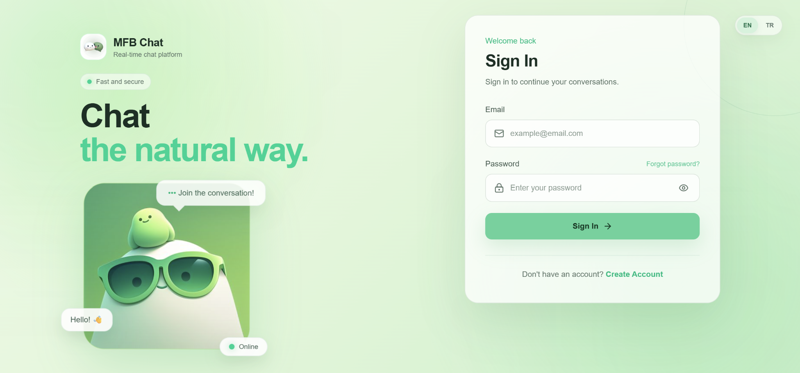
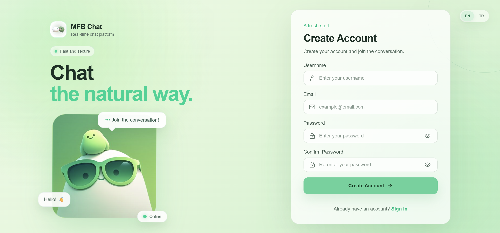
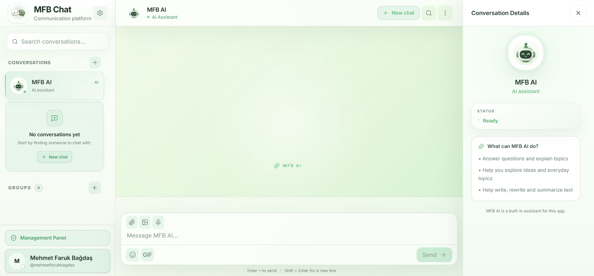
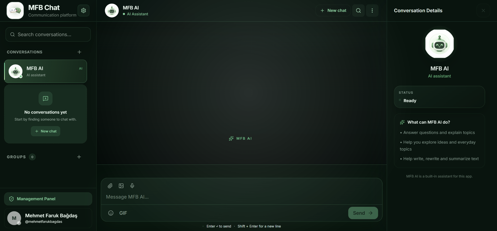
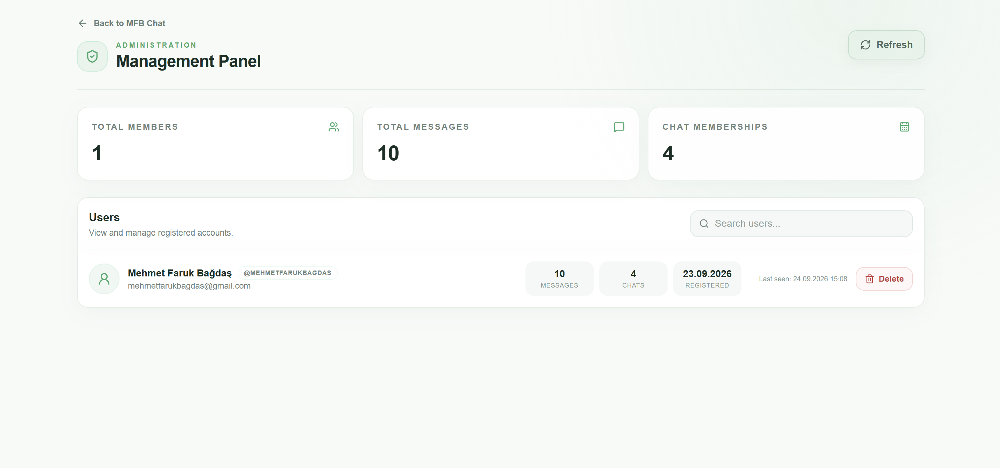
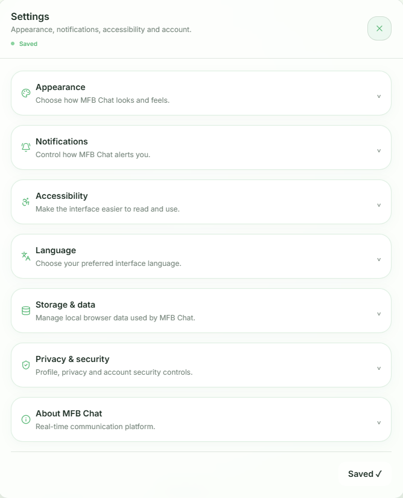
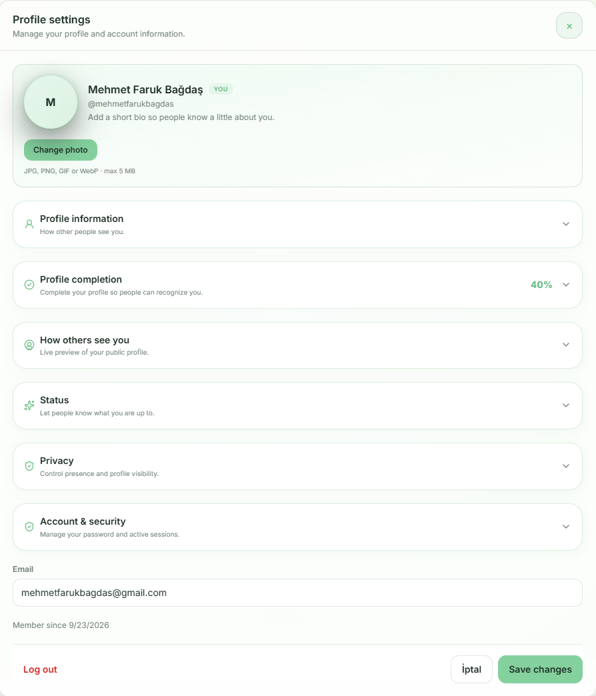

# MFB Chat

**MFB Chat** is a real-time communication platform that combines instant messaging, group conversations, and a built-in AI assistant in a single application.

🔗 **[Live Demo](https://mfbchatapp.vercel.app/)**

## Features

- Real-time one-to-one messaging
- Group conversations and group management
- Instant communication with SignalR
- File, image, and message attachment sharing
- Message and conversation search
- Online status and last seen information
- Read receipts
- Built-in MFB AI assistant
- Create new conversations
- Shared media, links, and files
- Mute conversations
- Browser notifications
- Profile and profile visibility settings
- Privacy and account security controls
- Email verification and password reset
- JWT / refresh token-based authentication
- Light and dark themes
- Turkish and English language support
- Accessibility settings
- Local storage and data settings
- Management panel with user and chat statistics

## Technologies

### Backend

- C#
- ASP.NET Core Web API
- Entity Framework Core
- SignalR
- PostgreSQL
- JWT Authentication

### Frontend

- Next.js
- React
- TypeScript
- Tailwind CSS

## Screenshots

### Sign In & Registration

| Sign In                                  | Create Account                                         |
| ---------------------------------------- | ------------------------------------------------------ |
|  |  |

### Chat

**Light Theme**



**Dark Theme**



### Management Panel



### Profile Settings



### General Settings



## Project Structure

```text
MFBChatApp/
├── backend/
│   ├── ChatApp.API
│   ├── ChatApp.Application
│   ├── ChatApp.Domain
│   └── ChatApp.Infrastructure
│
└── frontend/
    ├── app/
    ├── components/
    ├── lib/
    └── public/
```

## Setup

### 1. Clone the repository

```bash
git clone <repository-url>
cd MFBChatApp
```

### 2. Configure the backend

Add the required database connection and authentication settings to the backend configuration.

### 3. Apply migrations

```bash
dotnet ef database update --project ChatApp.Infrastructure --startup-project ChatApp.API
```

### 4. Run the API

```bash
dotnet run --project ChatApp.API
```

### 5. Run the frontend

```bash
cd frontend
npm install
npm run dev
```
